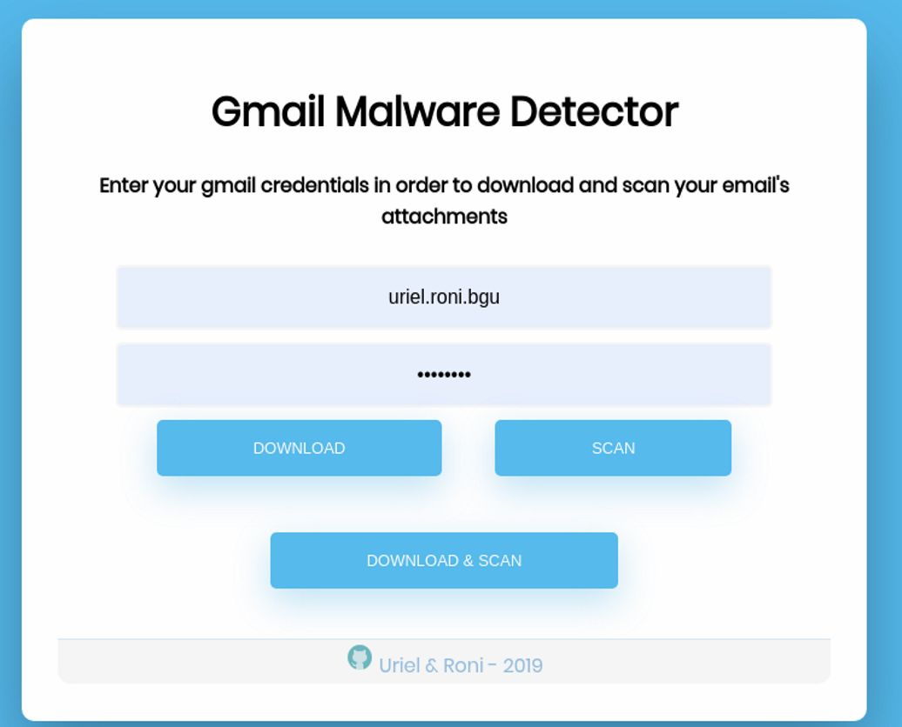
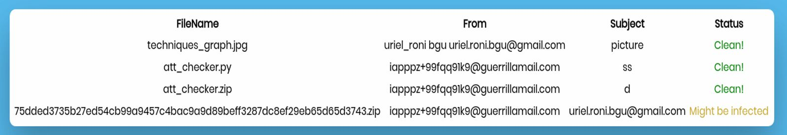
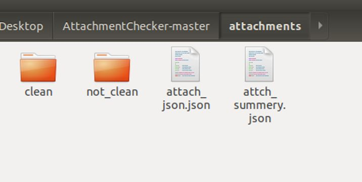

# AttachmentChecker
<h3>Automate check for malicious attachments in gmail accounts.</h3>

Download the [AttachmentChecker.ova](https://drive.google.com/open?id=1W8x5qvrkv5XosSF_ug_a4cm39mjwCJoy) file and import it using VirtualBox.

Run the machine and open Chrominim borwser at "127.0.0.1:5000".

You will be requested for your email credentials, and than the checker will download your email attachments to AttachmentChecker\attachemnts and then will scan them using VirusTotal-API.

When the scan ended, a summery of your attachments-risk status will appear (the status are "clean", "might be infected" or "infected")

The downloaded files then will divide to "clean" and "not clean" folders, inside the attachments directory.

